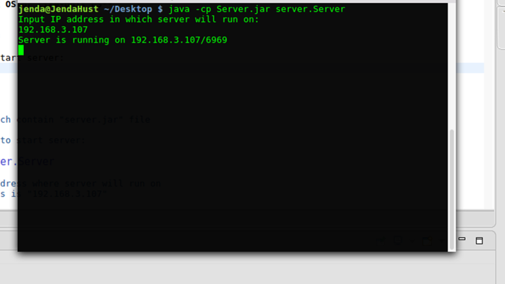

# MySSH - Distributed System Project
**Server should be run on Linux OS or Like-Unix OS** 
## How to start

*   **Start Server (on Linux)**

There are 2 different ways to start server:

1.  With Terminal

>	Open Terminal

>	Change to the directory which contain "server.jar" file

>	Run following command line to start server:
	
	java -cp server.jar server.Server

>	Here you have to into IP address where server will run on

>   Example, server's ip address is "192.168.3.107"
 

		
2.  
    
*   **Run Client**

